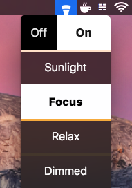

# Chromabar

This is a really hacky menubar item to control hue lights. Coded while reading
the hue api in an hour or two :)

I made this because I didn't like the existing hue controls for your menubar.

Note that error handling and setup are very, very rudimentary.

I might come back and actually make this good someday ;)
In the meantime, pull requests will be considered.

If you'd like to create a username, please see the official Hue documentation
[here](https://developers.meethue.com/documentation/getting-started). While
signing up is required, there are no fees.

If you'd like to reset your bridge ip or username, shift-alt-click the "Off"
button at the top left of the window. Additionally, windows informing you of
an error will contain a "Reset Everything" button.
